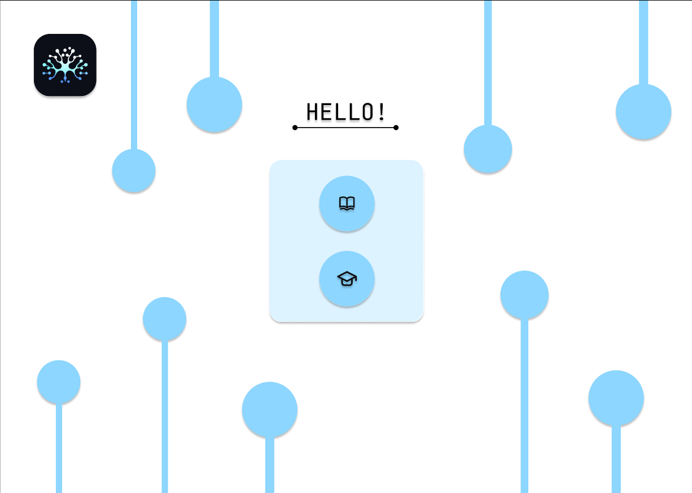
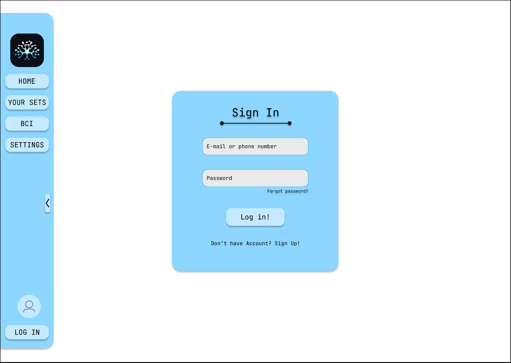

<h1>Hello!</h1>

<h3>There is a UI/UX design of web aplication for science Club NEURON </h3>

https://www.figma.com/proto/LDr9wKw40K9S5klm2wQtZM/Slytherin?page-id=0%3A1&type=design&node-id=15-101&viewport=-528%2C699%2C0.5&scaling=min-zoom&starting-point-node-id=170%3A330

